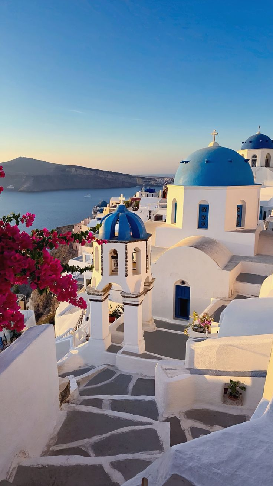

<html lang="en">
<head>
  <meta charset="UTF-8" />
  <meta name="viewport" content="width=device-width, initial-scale=1" />
</head>
<body>
<header class="d-flex justify-content-between align-items-center px-4">
  <h1>Dream Travel 💗</h1>
  <nav>
    <ul class="navbar-nav flex-row gap-4 mb-0">
      <li><a href="#about">About Me</a></li>
      <li><a href="#destinations">Top 6 Travel Destinations</a></li>
      <li><a href="#facts">Facts & Why I Want to Travel</a></li>
	  <li><a href="#contact">Contact</a></li>
    </ul>
  </nav>
</header>
<!-- Yellow top bar -->

  ✈️ Dream Travel Destinations 💗

<!-- Welcome Message -->

  👋 Welcome to my website!	
<!-- About Me Section -->
<section class="section-box" id="about">
  <h2>About Me 👋</h2>
  
Hello! My name is Nafisha Shamiha Islam. I go by Miha as well! I love to travel and explore different cultures, foods, history, and scenery from around the world. Traveling gives me comfort. This website is a small reflection of the places I want to visit someday. I believe travel opens the heart and mind! I'm excited to share my dream destinations with you!

</section>
 <!-- Template Credit -->
  

    Template source: 
    <a href="https://themewagon.github.io/iPortfolio/index.html" target="_blank" rel="noopener noreferrer">
      iPortfolio Template by Themewagon
    </a>
  

<!-- Top 6 Destinations Section -->
<section class="section-box" id="destinations">
  <h2>Top 6 Dream Travel Destinations ✈️</h2>
  

    <h3>1. Istanbul, Turkey 🕌</h3>
    
    
    
    <h4 class="highlight-text">
      Rich in culture and history, Istanbul connects Europe and Asia in a magical way.
    </h4>
  

  

    <h3>2. Paris, France 🗼</h3>
    
    
    
    
    <h4 class="highlight-text">
      Fall in love with the City of Lights – home to the Eiffel Tower and world-famous art.
    </h4>
  

  

    <h3>3. Edinburgh, Scotland 🏰</h3>
    
    
    
    
    <h4 class="highlight-text">
      Stunning castles, cozy pubs, and beautiful highlands await you in Scotland's capital.
    </h4>
  

  

    <h3>4. Santorini, Greece 🌊</h3>
    
    
    
    
    <h4 class="highlight-text">
      Famous for its white-washed buildings and unforgettable Aegean sunsets.
    </h4>
  

  

    <h3>5. Zurich, Switzerland 🏔️</h3>
    
    
    
    
    <h4 class="highlight-text">
      Enjoy majestic Alps, serene lakes, and some of the best chocolate on Earth.
    </h4>
  

  

    <h3>6. Vienna, Austria 🎻</h3>
    
    
    
    
    <h4 class="highlight-text">
      Enjoy coffeehouse culture, home of Mozart, beautiful museums, and operas.
    </h4>
  

</section>
<!-- Facts Section -->
<section class="section-box" id="facts">
  <h2>Facts & Why I Want to Visit These Places 💬</h2>
  
Each place holds something special, whether it’s history, beauty, adventure, or peace. I’ve collected some fun facts and my personal reasons for wanting to visit each of these amazing destinations.

  <a href="factsandwhyiwanttotravel.html" class="btn-link" target="_blank" rel="noopener noreferrer">
    📍 Click here to view the facts and reasons
  </a>
</section>
<!-- Interactive Dream Destination Input -->

  <h2>✨ Tell me your dream destination!</h2>
  <button onclick="suggestDestination()">Click Here</button>
  

<!-- Contact Section -->
<section class="section-box" id="contact">
  <h2>Contact 📧</h2>
  
If you have any questions, suggestions, or just want to say hello, feel free to reach out to me!

  
Email: 
    <a href="mailto:s24224019@al.tiu.ac.jp" style="color: #1d3557; font-weight: bold;">
      s24224019@al.tiu.ac.jp
    </a>
  

</section>
<footer>
  
Student ID: 24224019 | Name: Nafisha Shamiha Islam

</footer>
<!-- Scroll to top button -->

  <i class="bi bi-arrow-up-short"></i>

</body>
</html>
