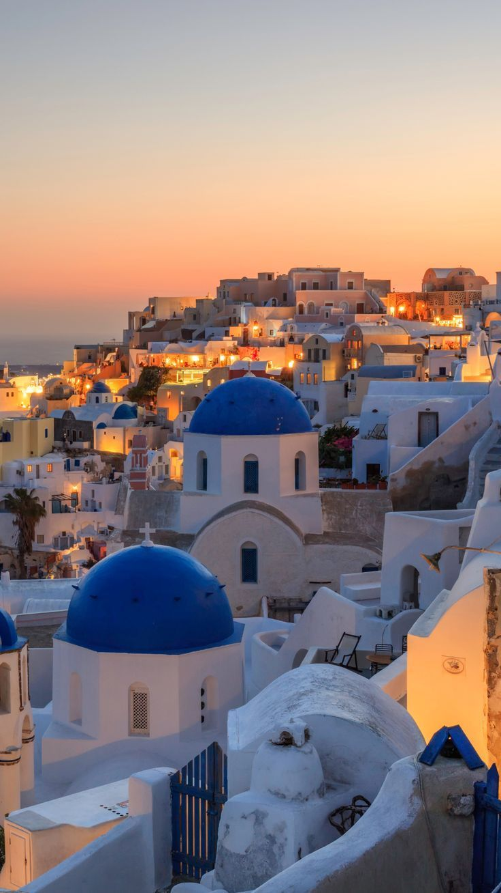
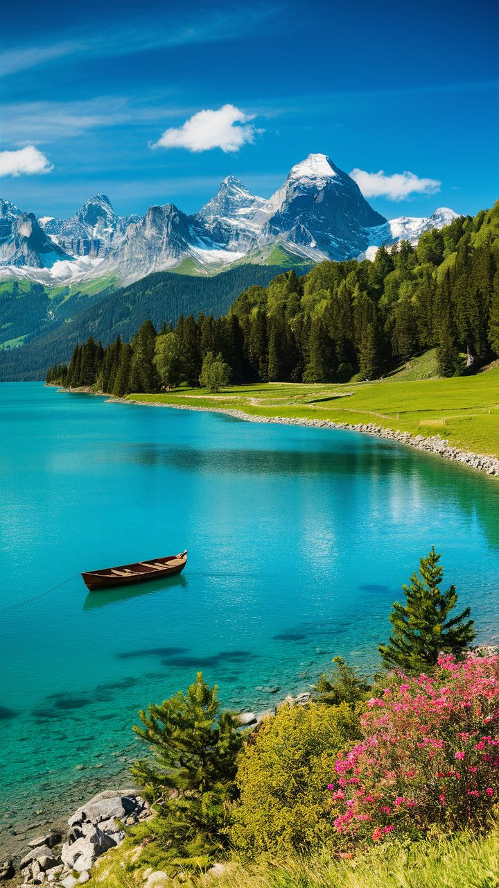

<html lang="en">
<head>
 <title>Dream Travel</title>
  <!-- Bootstrap CSS -->
  <link href="https://cdn.jsdelivr.net/npm/bootstrap@5.3.0/dist/css/bootstrap.min.css" rel="stylesheet">
</head>
<body>
<!-- Navigation Bar -->
<nav class="navbar navbar-expand-lg navbar-light bg-light fixed-top py-3">
  

    <button class="navbar-toggler" type="button" data-bs-toggle="collapse"
      data-bs-target="#navbarContent" aria-controls="navbarContent" aria-expanded="false"
      aria-label="Toggle navigation">
      
    </button>

    

      <ul class="navbar-nav ms-auto align-items-center">
        <li class="nav-item px-3">
          <a class="nav-link" href="#about">About Me</a>
        </li>
        <li class="nav-item px-3">
          <a class="nav-link" href="#destinations">Destinations</a>
        </li>
        <li class="nav-item px-3">
          <a class="nav-link" href="#facts">Why I Want to Travel</a>
        </li>
        <li class="nav-item px-3">
          <a class="nav-link" href="#contact">Contact</a>
        </li>
      </ul>
    

  

</nav>
</body>
<!-- Add this to make the navbar not overlap your content -->

<head>
  <meta charset="UTF-8" />
  <meta name="viewport" content="width=device-width, initial-scale=1" />
</head>
<body>

  ✈️ Dream Travel Destinations 💗

👋 Welcome to my website!

<section id="about">
  <h2>About Me 👋</h2>
  
Hello! My name is Nafisha Shamiha Islam. I go by Miha as well! I love to travel and explore different cultures, foods, history, and scenery from around the world. Traveling gives me comfort. This website is a small reflection of the places I want to visit someday. I believe travel opens the heart and mind! I'm excited to share my dream destinations with you!

</section>

  <h2>✨ Tell me your dream destination!</h2>
  <button onclick="suggestDestination()" class="btn-warning">Click Here</button>
  

<section style="text-align:center; font-size: 0.9em; color: gray; margin: 30px auto;">
  Template source: 
  <a href="https://themewagon.github.io/jadoo/v1.0.0/" target="_blank" rel="noopener noreferrer" style="color: #1d3557;">
    Jadoo Template by Themewagon
  </a>
</section>

<section id="destinations">
  <h2>Top 6 Dream Travel Destinations ✈️</h2>

  

    <h3>1. Istanbul, Turkey 🕌</h3>
    
    
    
    
    <h4 class="highlight-text">Rich in culture and history, Istanbul connects Europe and Asia in a magical way.</h4>
  

  

    <h3>2. Paris, France 🗼</h3>
    
    
    
    
    <h4 class="highlight-text">Fall in love with the City of Lights – home to the Eiffel Tower and world-famous art.</h4>
  

  

    <h3>3. Edinburgh, Scotland 🏰</h3>
    
    
    
    
    <h4 class="highlight-text">Stunning castles, cozy pubs, and beautiful highlands await you in Scotland's capital.</h4>
  

  

    <h3>4. Santorini, Greece 🌊</h3>
    
    
    
    
    <h4 class="highlight-text">Famous for its white-washed buildings and unforgettable Aegean sunsets.</h4>
  

  

    <h3>5. Zurich, Switzerland 🏔️</h3>
    
    
    
    
    <h4 class="highlight-text">Enjoy majestic Alps, serene lakes, and some of the best chocolate on Earth.</h4>
  

  

    <h3>6. Vienna, Austria 🎻</h3>
    
    
    
    
    <h4 class="highlight-text">Enjoy coffeehouse culture, home of Mozart, beautiful museums, and operas.</h4>
  

</section>

<section id="facts">
  <h2>Facts & Why I Want to Visit These Places 💬</h2>
  
Each place holds something special, whether it’s history, beauty, adventure, or peace. I’ve collected some fun facts and my personal reasons for wanting to visit each of these amazing destinations.

  
<a href="factsandwhyiwanttotravel.html" class="btn-link" target="_blank" rel="noopener noreferrer">📠Click here to view the facts and reasons</a>

</section>

<section id="contact">
  <h2>Contact 📧</h2>
  
If you have any questions, suggestions, or just want to say hello, feel free to reach out to me!

  
Email: <a href="mailto:s24224019@al.tiu.ac.jp" style="color: #1d3557; font-weight: bold;">s24224019@al.tiu.ac.jp</a>

</section>

<footer>
  
Student ID: 24224019 | Name: Nafisha Shamiha Islam

</footer>

&#8679;

</body>
</html>
